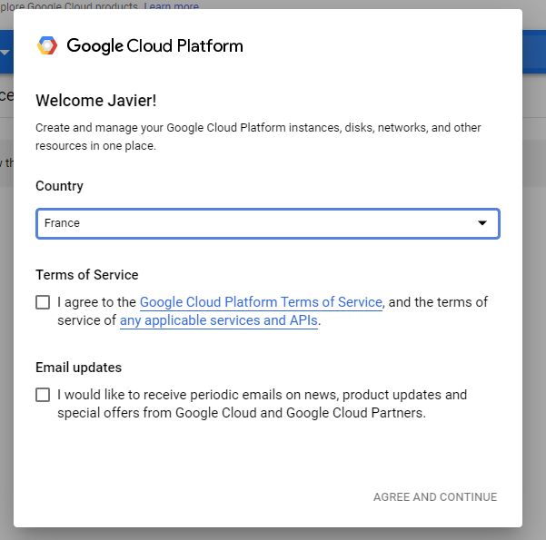
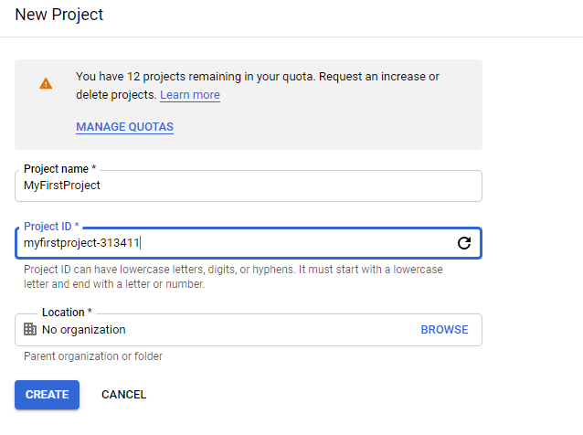

### Objectives

The goal of this challenge is to set up your Big Query Sandbox.

### Specs

All you need to start your journey in Google Cloud Platform (GCP) & Big Query is a Google account. The one that you use for Gmail will work. If you don’t have one, you can [create it here](https://accounts.google.com/signup/).

Once you create it, navigate to the [Big Query interface](https://console.cloud.google.com/bigquery).

Alternatively, if you want to have an overview of all GCP services you can access to the [Google Cloud console](https://console.cloud.google.com/). Then you can find Big Query in the navigation menu on the top left.

1. **Name 3 Big Data services in Google Cloud Platform (GCP).**

The first time you access to GCP/Big Query you will be asked to fill some basic information & agree terms of service.

Remember that during this course we will be using the **Big Query Sandbox**. This is the no cost mode of Big Query that allows you to store up to 10 GB of data and to process 1TB/month of data for free. To use it, **you don’t have to provide your credit card information!**

In the Big Query page, you can create your first project. Remember that you can change its ID. The ID by default attaches a string that assures that it's unique. 

Also, it allows you to link the project to an organization given that your Google account is linked to one. 

For a summary of Big Query UI [you can take a look here](https://cloud.google.com/bigquery/docs/bigquery-web-ui)

**2. In the  project that you have just created, create a dataset called *employees* with a data location in the US.**

**3. Within the *employees* dataset create an empty table called *sales* via the Editor (in Standard SQL). It must have the following fields*: id, last_name, creation_date , last_login, is_manager, supervisors_id*. Also the table must have a description and a label. A row of this table will look like:**

[Untitled](https://www.notion.so/78e30601b83e4e8fa5bbf94da91daf31)

- Trick

    In case of doubt about the data types look [here](https://cloud.google.com/bigquery/docs/reference/standard-sql/data-types)

**4. Create another empty table within the *employees* dataset called *marketing* using the Create Table button in the dataset tab.**

### Key learning points

- Become comfortable moving around Cloud Platform and Big Query
- Create your first project, dataset and tables
- Learn to create a table schema
