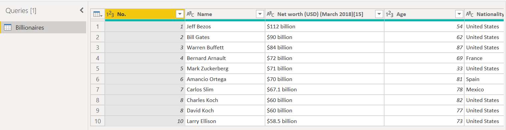

Let's begin !

Who are the richest people in the world?! 🕵️‍♂️

## Background & Objectives

The goal of this challenge is to learn how to load a data source and do some basic data cleaning.

## Import file

Create a new Power BI report, and load in the data from this workbook:

[Richest people.xlsx](assets/Richest_people.xlsx)

Let's clean our data now !

## Data cleaning

Use Query Editor to make this data look better:

1. Rename your columns:
    1. No. ⇒ Rank
    2. Net worth (USD)(March 2018)[15] ⇒ Billions ($)
2. Format the "Billions ($)" column to a whole number format

Hint 💡

- (Step 0: Replace the "." (point) with a "," (coma) )
- Step 1: Replace the word billion with an empty string.
- Step 2: Replace the $ symbol with an empty string.
- Step 3: Convert the resulting column to a whole number.

## Data visualization

Once your data is ok, bring it back into your Power BI report, and use it to create a simple chart.

We want to sum up the `total billions owned by nationality` in a matrix.

So far, so good ?

Let's go further.

## Enrich your data

We now want to sum up the total billions per `age category`.

Use Query Editor to enrich your data:

1. Create a new Conditional column "Age category"
2. Categorise billionaires into 3 categories:
    1. If Age ≥ 80 years ⇒ "Old"
    2. If 50 ≤ Age < 80 years ⇒ "Midle age"
    3. Else ⇒ "Young"
- Hint 💡
    - Condition to apply below:

    

## Data visualization again

Once your data is ok, bring it back into your Power BI report, and use it to create a simple chart.

We want to sum up the `total billions owned by age category` in a matrix.

## Merge data

Import the file below:

[Business sector.xlsx](assets/Business_sector.xlsx)

It represents the business sector per company.

## Enrich your data even more

We now want to sum up the total billions per business sector:

1. First, you've noticed the first line of your fill is not recognized as a header. Add a new step "Use First Row as Headers"
2. As you can see, you have a duplicated row in your dataset, remove it
    - Hint 💡
        - Select all columns
        - Home ⇒ Remove rows ⇒ Remove duplicates
3. Merge your dataset "Billionaires" and "Sector"

    ⚠ Matchting columns have not the same name, you need to select them.

    - Hint 💡

        

4. Rename your new dataset "Billionaires - Sector"
5. Expand the merge table and select only the "Business sector" column
6. Remove the alias "Sector." to the "Sector.Business sector" column
7. In the Power BI report, build your `matrix total billions per business sector`

Save your file as **Billions**. 💾
