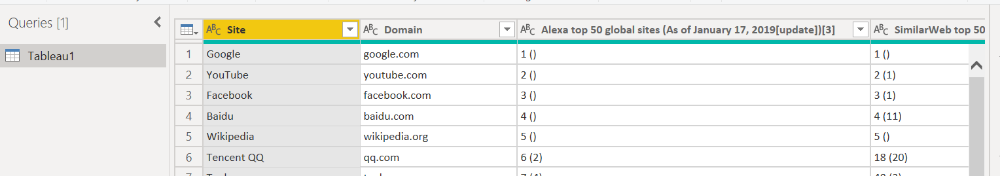

Let's analyse numbers from the top websites.

## Background & Objectives

The goal of this challenge is to learn how to do some advanced data cleaning.

## Import file

Create a new Power BI report, and load the data from this file:

[Top websites.xlsx](assets/Top_websites.xlsx)

## Data cleaning

Use Query Editor to make this data look better:

1. Rename your dataset "Websites"
2. Rename your column:
    1. Alexa top 50 global sites (As of January 17, 2019[update])[3] ⇒ Alexa rating
3. Remove "SimilarWeb top 50 sites (As of December 2018)[4]" column
4. Format "Alexa ranking" column to whole number

Hint 💡

  - Use the "Extract" function

## Data visualization

Once your data is ok, bring it back into your Power BI report, and use it to create a simple chart.

We want to sum up the `best rank for each country` in a matrix.

Hint 💡

  - Use the "Min" function in your matrix

Save your file as **Top websites**. 💾
