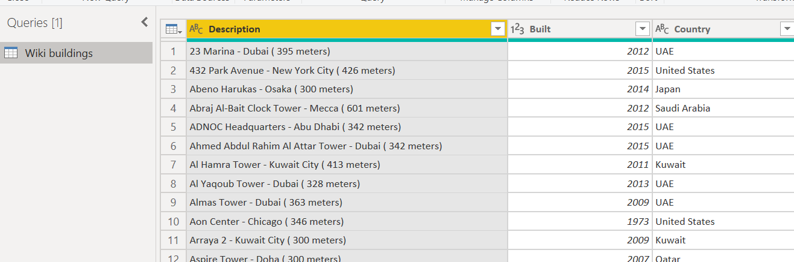

Which building has the tallest floor ?!

## Background & Objectives

The goal of this challenge is to learn how to do some advanced data cleaning and calculate custom columns.

## Import file

Create a new Power BI report, and load the data from this file:

[Wiki buildings.csv](https://wagon-public-datasets.s3.eu-west-1.amazonaws.com/bi-data/Wiki_buildings.csv)

## Data cleaning

Use Query Editor to re-arrange some columns:

1. From "Description" column, create new columns:
  1. Building
  2. City
  3. Height
2. Add a custom column "Average floor height (m)" for the average floor height of a building (it's the height in metres divided by the number of floors)

*Output expected* 👆

## Data visualization

Once your data is ok, bring it back into your Power BI report, and use it to **create some charts**.

- We want to visualize `how many builings were created per year` in a column chart.

- We want to see `for each country what is the tallest floor and the tallest building` in a matrix.

Save your file as **The tallest buildings**. 💾
