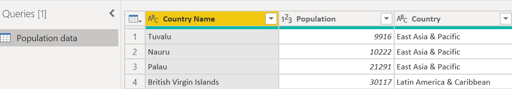

Let's begin!

## Background & Objectives

The goal of this challenge is to create and customize your first charts.

## Import file

Create a new Power BI report, and load in this data:

[Populations.xlsx](assets/Populations.xlsx)

## Data visualization

First, we want to vizualise the `population by area` in a `donut chart`.

Use the formatting options in order to get the following design:

1. Move the legend to the left part
2. Set a title
3. Customize data label settings
    1. Billions ⇒ millions
    2. Switch the % repartition to the area name
4. Set a border 

*Here is the chart expected* 👆

## Let's dig ! ⛏

We now want to have more information in this chart.

For every area, let's display the `population by country`.

Hint 💡

  - For the information, we will use the `drill/down`

*Chart expected* 👆

Save your file as **Populations**. 💾
