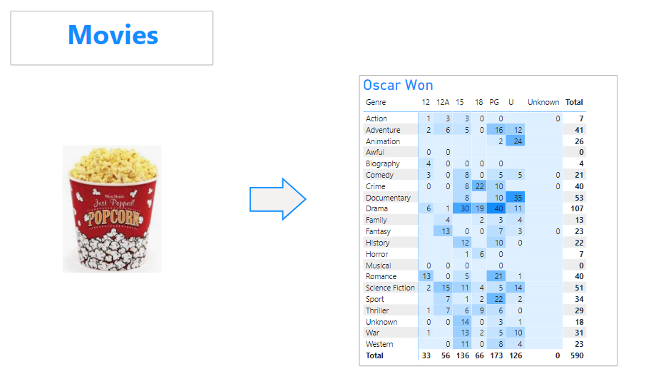

## Background & Objectives

The goal of this challenge is to create your first basic report.

## Import file

Create a new Power BI report, and load the data available in this file:

[Films.zip](https://wagon-public-datasets.s3.eu-west-1.amazonaws.com/bi-data/Films.zip)

## Data visualization

Let's create your first Power BI report!

Insert the image from the zip file.

Report *expected* 👆

In your report, insert:

1. A title
2. The image attached in the zip file
3. An arrow shape
4. A matrix showing `oscar won by genre and certificate`
    1. Add a title
    2. Use the conditionnal formating to highlight big numbers

Congratulations, you've created your first PBI report ! 👏

Save your file as **Movies**. 💾
